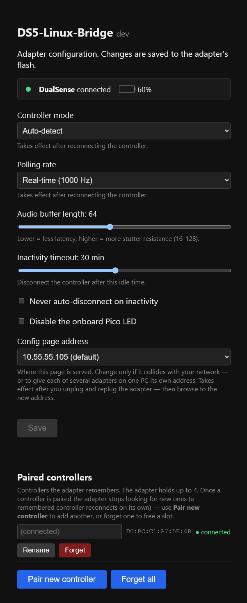

# DS5-Linux-Bridge — User Guide

Operational manual for the firmware: flashing, WiFi setup, pairing, the config
page, Wake-on-LAN, and OS-specific (Linux / Windows) behavior. For building from
source and debugging, see the [README](../README.md).

- [Flashing the firmware](#flashing-the-firmware)
- [First-time WiFi setup](#first-time-wifi-setup)
- [Pairing a controller](#pairing-a-controller)
- [Adding a second controller](#adding-a-second-controller)
- [The configuration page](#the-configuration-page)
  - [Live status](#live-status)
  - [Paired controllers (bond management)](#paired-controllers-bond-management)
  - [Network settings](#network-settings)
- [Waking your PC](#waking-your-pc)
  - [Wake-on-LAN](#wake-on-lan)
  - [USB wake keyboard](#usb-wake-keyboard)
- [Steam Deck plugin](#steam-deck-plugin)
- [Operating system & driver behavior](#operating-system--driver-behavior)

---

## Flashing the firmware

1. Hold the **BOOTSEL** button on your Raspberry Pi Pico 2 W.
2. Connect it to your PC via USB. It mounts as a drive named `RP2350`.
3. Drag and drop the compiled `.uf2` firmware onto that volume. The board
   reboots into the firmware automatically.

---

## First-time WiFi setup

The adapter serves its config page and sends Wake-on-LAN over your home WiFi, so
the first time you run it you tell it which network to join.

1. On first boot (with no WiFi saved) the adapter starts its own open setup
   network named **`DS5-Setup-XXXX`** (the `XXXX` is unique per adapter).
2. Join it from a phone or laptop and browse to **http://10.55.55.105/**.
3. Pick your home WiFi from the list, enter its password, and save. The adapter
   reboots and joins your network.

Once it's on your WiFi, the setup network disappears and the config page moves to
**http://ds5.local/** (see [The configuration page](#the-configuration-page)).

> **If it can't join** (wrong password, or the network went away), the adapter
> gives up after a short wait and re-opens the `DS5-Setup-XXXX` network so you can
> try again. You never get locked out. To wipe saved WiFi on purpose, use
> **Reset saved WiFi** on the config page's Network tab.

The controller itself does **not** need WiFi — pairing and gameplay work over
Bluetooth regardless. WiFi is only for the config page and Wake-on-LAN.

---

## Pairing a controller

1. Put the DualSense into Bluetooth pairing mode: hold **Share + PS** until the
   lightbar double-blinks.
2. The adapter detects, pairs, and connects. The onboard LED goes solid on a
   successful connection.
3. Once connected, the adapter presents the controller (gamepad, audio, haptics)
   to the host.

The adapter remembers controllers it has paired with (up to four). **It only
scans for a new controller when none is remembered.** Once at least one
controller is paired, it stops scanning — a remembered controller reconnects on
its own when you turn it on — so a nearby DualSense in pairing mode won't get
grabbed by your adapter.

If you cold-plug the adapter with no controller around, it stays in pairing mode
until the first controller pairs; after that, turning that controller on
reconnects it automatically.

---

## Adding a second controller

Because the adapter connects **one controller at a time**, and it stops scanning
once a controller is remembered, adding a *second* controller is a deliberate
action rather than something that happens automatically.

On the [config page](#the-configuration-page), under **Paired controllers**,
click **Pair new controller**. This:

1. Disconnects the controller you're currently using — but **keeps its bond**, so
   it still reconnects later.
2. Opens a 30-second pairing window. Put the new controller into **Share + PS**
   pairing mode during that window.
3. The new controller connects and is remembered as an additional bond. The
   previous controller is held off during the window so it can't grab the slot
   back before the new one finishes pairing.

> The config page is reachable whether or not a controller is connected, so you
> can also reach it (and pair) when the adapter is idle.

---

## The configuration page

Once the adapter is on your WiFi (see [First-time WiFi setup](#first-time-wifi-setup)),
it hosts its own configuration web page — no app, no browser API, no internet
needed. The page is reachable **whether or not a controller is connected**, from
any device on the same network.

  

1. Open **http://ds5.local/** in any browser.
2. The page has four tabs:
   - **Controller** — controller mode, polling rate, audio buffer length,
     inactivity timeout, auto-disconnect, and the onboard LED.
   - **Paired** — the controllers the adapter remembers (see
     [below](#paired-controllers-bond-management)).
   - **Network** — the adapter's name and WiFi (see
     [Network settings](#network-settings)).
   - **Wake / WOL** — Wake-on-LAN and the USB wake keyboard (see
     [Waking your PC](#waking-your-pc)).
3. Adjust settings and click **Save**. Settings are written to the adapter's
   flash.

> `ds5.local` uses mDNS (Bonjour), which works out of the box on Windows, macOS,
> and most Linux desktops. If your device can't resolve `.local` names, browse to
> the adapter's IP address instead — you can find it in your router's client list,
> or it's printed to the debug UART on boot.

Flash writes from the page (saving settings, renaming/forgetting bonds) are made
**audio-safe**: the audio core is briefly parked during the flash erase/program
so writing while a controller streams audio doesn't corrupt the stream.

### Live status

The top of the page shows a live status card — whether a controller is
connected, its model (DualSense / DualSense Edge), and a battery gauge (percent
plus a charging indicator) — refreshed every few seconds. It's served from a
read-only `GET /api/status` endpoint, so any client (including the
[Steam Deck plugin](#steam-deck-plugin)) can poll it.

### Paired controllers (bond management)

The page lists the controllers the adapter remembers (the Bluetooth link keys it
stores, up to four). For each you can:

- **Rename** it with a short nickname (≤15 chars), stored in the adapter's flash.
- **Forget** it, or **Forget all** — clears the stored link key(s) so the slot is
  freed.
- **Pair new controller** — see [Adding a second controller](#adding-a-second-controller).

Forgetting a controller disconnects it if it's the one currently connected, and
blacklists its Bluetooth address so it can't silently auto-reconnect afterward.
To bring a forgotten controller back, re-pair it explicitly (**Share + PS**),
which clears the blacklist entry on a successful pair. The blacklist persists
across power cycles.

### Network settings

The **Network** tab has two things:

- **Device name** — the name the adapter uses on your network. The default is
  `ds5`, so the page lives at `ds5.local`. If you run more than one adapter,
  give each a unique name (e.g. `ds5-den`) so they don't collide — letters,
  digits, and hyphens only. A rename takes effect after the adapter reboots, and
  you then reach it at `http://<name>.local/`.
- **Reset saved WiFi** — forgets the saved network and reboots into the
  `DS5-Setup-XXXX` onboarding mode so you can join a different WiFi.

---

## Waking your PC

The adapter can wake your PC from sleep when you turn on or press a button on the
controller. There are two mechanisms, on the **Wake / WOL** tab, and you can use
either or both:

### Wake-on-LAN

The most flexible option — it works even when the PC is **fully off** (S4/S5),
which USB wake can't do. The adapter sends a "magic packet" over WiFi to wake the
PC's network card.

1. On the **Wake / WOL** tab, enter your PC's **MAC address**. Don't know it?
   Type your PC's IP address and click **Find MAC** — the adapter looks it up on
   your network for you.
2. Optionally add a **second target** (e.g. a TV) to wake at the same time.
3. **Save.** From now on, a controller PS-button press wakes the target(s). You
   can also test it with **Wake now**.

Your PC must have Wake-on-LAN enabled in its BIOS/UEFI **and** its OS network
driver. WOL over WiFi requires the PC's wireless card to support it (many do
better over wired Ethernet — the adapter's magic packet reaches both).

### USB wake keyboard

An optional fallback for boards that don't support Wake-on-LAN but *do* wake from
a USB keyboard. When enabled, the adapter adds a tiny keyboard to its USB identity
that types a silent key (F15) to wake the host from sleep (S3) on a controller
press.

It's **off by default** — with it off, the adapter presents only the DualSense
over USB, so anticheat software sees a plain controller. Turning it on trades that
away for the extra USB keyboard. Saving applies immediately (the adapter briefly
re-plugs itself). Wake-on-LAN doesn't need this.

> The DualSense also auto-powers off a few seconds after the host sleeps or shuts
> down, to save the controller's battery. Turning the controller back on wakes the
> host again.

---

## Decky Loader plugin

A [Decky Loader plugin](https://github.com/kungaa/DS5-Linux-Decky) surfaces the
adapter's controller status and settings directly in the Steam Deck Quick Access
Menu. It's a client of the same on-device HTTP API the web page uses, so it works
without any extra firmware. See that repository for installation and usage.

---

## Operating system & driver behavior

### Linux / SteamOS (Bazzite, CachyOS)

- **Native driver integration.** Compatible with the kernel `hid-playstation`
  driver. When the Linux driver is active, the firmware yields LED and button
  control to the OS driver to avoid conflicts.
- **Jack detection.** The DS5's real `HP_DETECT` / `MIC_DETECT` jack bits are
  passed through to the host so `hid-playstation` (kernel ≥6.18) emits
  `SW_HEADPHONE_INSERT` / `SW_MICROPHONE_INSERT`. The ≥6.17 USB-audio mixer quirk
  wires these to the ALSA "Headphone Jack" / "Headset Mic Jack" controls that
  `alsa-ucm-conf` uses to switch between the mono Internal Speaker and the stereo
  Headphones profiles. The firmware also forces the HP_DETECT bit high in the
  report it presents to the host to bias toward the stereo Headphones profile for
  headphone output.

> **Known issue — one-earphone / mono audio on some setups.** Audio routing is
> ultimately decided host-side by PipeWire/ALSA via `alsa-ucm-conf`, and on some
> distros/kernels it lands on a mono profile (audio in one earphone only). This is
> kernel- and UCM-version dependent rather than a firmware fault — stereo
> generally needs a recent kernel (≥6.18) with the jack-detect mixer quirk. Note
> that bleeding-edge / rolling distros (e.g. CachyOS, Arch) can also *regress*
> here: a newer kernel or updated `alsa-ucm-conf` can change the routing behavior
> and break a setup that previously worked. Investigation is ongoing.

### Windows 11

- **Audio & mute sync.** Runs driverless. The physical Mute button operates at the
  hardware level, muting the mic stream in firmware and lighting the controller's
  orange LED. Muting/unmuting via the Windows Sound panel also syncs the
  controller LED. (Because it is driverless, toggling the physical button won't
  move the Windows checkmark; the mic stream is muted directly on the adapter.)
- **HD haptics.** Work out of the box in titles that support them on a wired
  DualSense (e.g. Death Stranding Director's Cut).
